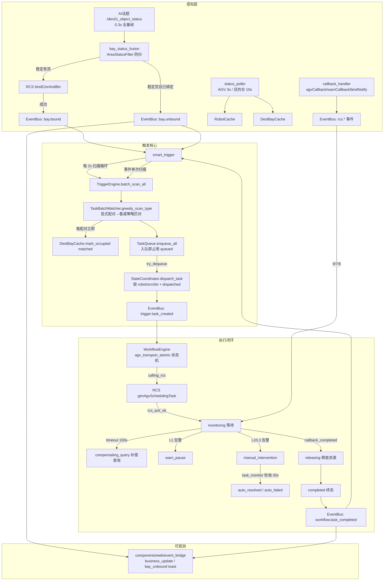
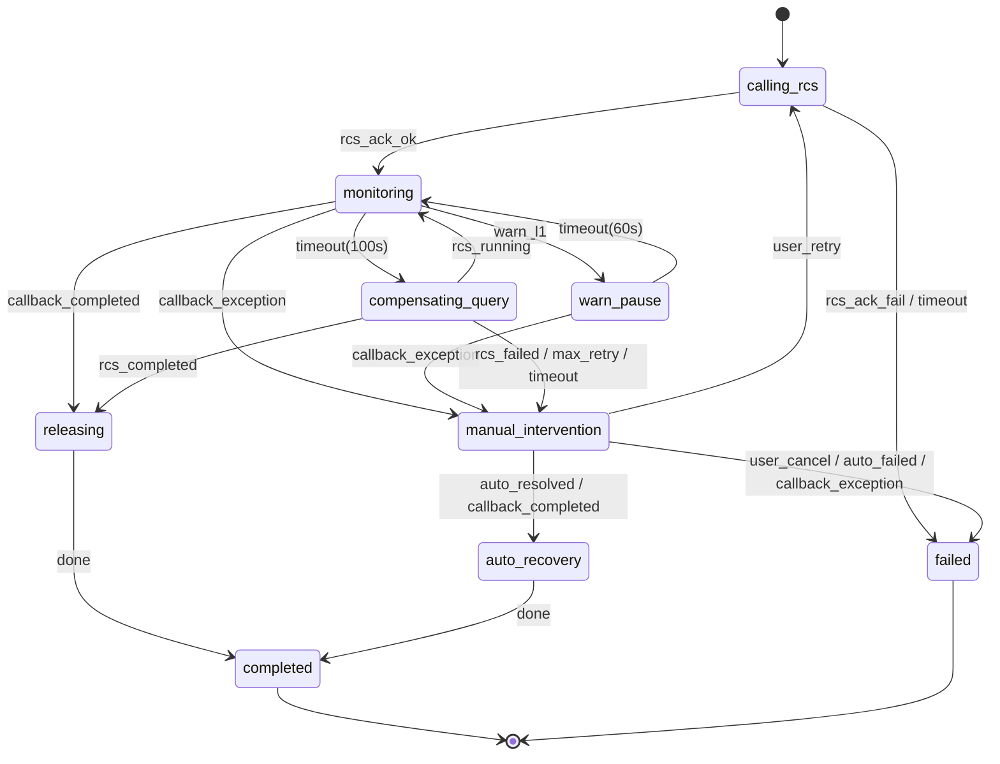

# app_mgr_object-0.2.0(标准版) 触发机制全链路分析报告

> 适用范围：AGV 搬运调度场景（AI 仓位检测 → RCS 绑定 → 任务匹对/入队/派发 → 工作流执行 → RCS 回调闭环）
> 工程版本：app_mgr_object-0.2.0(标准版)
> 文档生成方式：Codex `project-structure-review` skill 静态代码审查（2026-08-30）
> 分析范围：触发相关全部插件、组件、配置与既有文档（`doc/触发机制实施后审查报告-技术文档.md`、`doc/触发机制通用性可靠性审查及方案-技术规划.md` 为前序资料，本文为其全链路梳理与增量发现）

---

## 1. 触发机制一句话定位

系统以 **“AI 视觉检测 → RCS 绑定 → 定时/事件双驱动扫描 → 批量匹对 → 优先级队列 → AGV 感知派发 → YAML 工作流状态机执行 → RCS 回调/轮询双通道闭环”** 为核心，把“仓位有货”这一物理事件转换为一次可审计、可恢复、受工作时间和全局任务量约束的 AGV 搬运任务。

触发链路涉及 5 个插件与 3 组组件：

| 角色 | 模块 | 职责 |
| --- | --- | --- |
| 触发源（感知层） | `plugins/bay_status_fusion_plugin.py` | 订阅 AI 话题 `/dev01_object_status`，防抖滤波，稳定有货 → RCS 绑定并发布 `bay.bound`；稳定空/解绑 → 发布 `bay.unbound` |
| 触发源（状态层） | `plugins/status_poller_plugin.py` | 轮询 RCS：AGV 状态（3s）、目的仓位状态（10s），维护 `RobotCache` / `DestBayCache` |
| 触发源（回调层） | `plugins/callback_handler_plugin.py` | 接收 RCS `agvCallback` / `warnCallback` / `bindNotify`，转为 EventBus 事件 |
| 触发核心 | `plugins/smart_trigger_plugin.py` + `components/trigger/*` | 扫描循环 + 事件驱动扫描、批量匹对、任务队列、资源锁定、派发 |
| 执行闭环 | `plugins/workflow_engine_plugin.py` + `components/workflow/*` | 订阅 `trigger.task_created`，驱动 `agv_transport_atomic` 状态机，RCS 下发/等待/补偿/释放 |
| 兜底闭环 | `plugins/task_monitor_plugin.py` + `components/task_monitor/*` | 按需轮询任务状态，终态注入、人工介入自动闭环 |
| 可观测 | `components/web/event_bridge.py` | 业务事件 → WebSocket `business_update` / `bay_unbound` toast / 告警推送 |

---

## 2. 触发机制总体架构



---

## 3. 触发源与数据输入链路

### 3.1 AI 检测 → 绑定（正向触发源）

链路（`bay_status_fusion_plugin.py`）：

1. 订阅 `/dev01_object_status`（`BayStatus` 层级消息，含 device → channels → areas）；每帧全量发布（约 0.3s/帧）。
2. 每个仓位一个 `AreaStatusFilter`（`stable_threshold=3`、`filter_timeout=2.0s`），信号稳定后才视为“稳定有货/稳定空”（`_process_single_bay`，L248）。
3. 稳定有货：调用 RCS `bind_ctnr_and_bin` 绑定（`_on_stable_cargo`，L267）→ 成功 `set_bound` + 发布 `bay.bound`；失败 `set_unbound` + 错误日志。
4. 稳定空且当前绑定中：`set_unbound` + 发布 `bay.unbound`（`_on_stable_empty`，L314）。
5. 帧末 `prune_stale_bays`：按 `last_seen` 修剪主题中消失的仓位，同步清理滤波器（防内存累积）。

> 触发语义：**“绑定成功”才是任务生成的前提**（`BayCache.get_bound_bays_of_type` 只取 `bind_status==1` 且 `in_task==False` 的仓位），AI 有货本身不直接生成任务。

### 3.2 RCS 轮询（状态输入源）

`status_poller_plugin.py`：

- 启动后 0.5s 做一次初始全量轮询（AGV + 目的仓）。
- `_poll_robot_status`（L93）：3s 一次，RCS `IDLE→AVAILABLE`（可调度），其余映射 `BUSY/OFFLINE/ERROR`；`RobotCache.get_available_robot()` 按 AVAILABLE 列表轮询负载均衡。
- `_poll_dest_bays`（L141）：10s 一次，按 `ctnrCode` 是否为空更新 `DestBayCache` 的 `is_empty`；**`update()` 尊重 `_reserved` 保留占用**（L87：reserved 中的仓不会被轮询置回空）。
- `refresh_dest_bays`（L128）：销毁并重建目的仓轮询定时器 + 立即执行一次轮询（供绑定事件触发即时刷新）。

### 3.3 RCS 回调（事件输入源）

`callback_handler_plugin.py`（FastAPI 独立线程，`/eyeSky/robot/reporter/*`）：

| 路由 | 处理函数 | 发布事件 | 用途 |
| --- | --- | --- | --- |
| `POST /agvCallback` | `_on_agv_callback`（L176） | `rcs.agv_callback` | 任务状态（2 执行中 / 9 完成 / 7 失败 / 8 取消） |
| `POST /warnCallback` | `_on_warn_callback`（L204） | `rcs.warn_callback` | AGV 告警分级（L0~L3） |
| `POST /bindNotify` | `_on_bind_notify`（L235） | `rcs.bind_notify` + 同步缓存 | RCS 侧绑定/解绑通知 |

`bindNotify` 会同步更新 `BayCache` / `DestBayCache`（`_sync_cache_on_bind_notify`，L258 起），其中解绑（`ind_bind=="0"`）会 `set_unbound` + `mark_in_task(False)`。

---

## 4. 核心触发流程

### 4.1 正向任务触发（定时扫描 + 事件加速）

`smart_trigger_plugin.py` 激活时（`_activate_impl`）完成装配：

1. 依赖检查：`bay_status_fusion.cache`、`status_poller.dest_cache/robot_cache` 必须存在，否则激活失败。
2. 创建 `TriggerEngine`（含 `ResourceLocker` + `ScheduleChecker` + `TaskBatchMatcher`）。
3. 创建 `StateCoordinator`（统一资源状态联动）与 `TaskQueue`（老化 TTL 300s、max_size 50、绑定 dest_cache）。
4. 在节点主 asyncio 循环上启动 `_scan_loop` 扫描任务。
5. 订阅 `bay.bound` / `bay.unbound` / `workflow.task_completed` / `workflow.task_failed` / `workflow.resources_released`。

**定时扫描循环** `_scan_loop`（L202），周期 `scan_interval=2s`：

```text
age_out() 老化清理
  → 工作时间窗口检查（不在窗口则休眠）
  → 获取全局容量 capacity = max_total_tasks - 队列长度 - 运行中实例数
  → 加 asyncio 扫描锁（与事件扫描互斥）
  → batch_scan_all(min(max_tasks_per_scan, capacity), 排除 queued/locked 的 src/dst)
  → 重算 capacity 并截断候选
  → enqueue_all(候选, max_total=capacity)（入队即占用目的仓）
  → 释放扫描锁
  → _dispatch_from_queue()（锁外，每轮最多 3 个）
```

**事件驱动扫描** `_on_bay_bound`（L296）：

```text
bay.bound 事件
  → status_poller.refresh_dest_bays()（立即刷新目的仓）
  → run_coroutine_threadsafe(_scan_and_dispatch_once()) 提交到主 asyncio 循环
```

`_scan_and_dispatch_once`（L336）与主循环共用 `_scan_lock`，保证主循环扫描与事件扫描互斥，避免并发超发候选。

**派发** `_dispatch_from_queue`（L251）：

```text
循环（每轮最多 3 次）：
  try_dequeue()
    → 队列非空 + 有空闲 AGV + StateCoordinator.dispatch_task 资源锁定成功
    → 出队并生成 task_id = TASK_{src_bay}_{时间戳}
  → 发布 trigger.task_created
```

**事件闭环**：

- `_on_task_completed`（L317）/ `_on_task_failed`：经 `StateCoordinator.release_task` 幂等释放（工作流已释放则跳过），随后立即 `_dispatch_from_queue()` 补位。
- `_on_bay_unbound`（L307）：`TaskQueue.remove_by_src(bay_id)`，将该始发仓的排队任务移出，并释放对应目的仓占用（`source='unbind'`，前端显示蓝色解绑态）。

### 4.2 匹对与巷道选择

`TaskBatchMatcher.greedy_scan_type`（`batch_matcher.py` L145）：

1. **显式配对覆盖优先**：`pair_overrides[src] = dst` 若目的仓为空且未被本批使用，直接配对。
2. **策略匹对**：剩余 src 按 `(bay_id, -bind_time)` 排序（区域 A→D、编号升序，绑定时间仅作次级）；每配对一个 src：
   - `DestBayCache.select_by_strategy(cargo_type, src_bay, exclude)` 选目的仓；
   - **立即 `mark_occupied(dst, 'matched')`**（匹对稳定：下一个 src 基于更新后状态选择，避免多始发指向同一空仓）；
   - 生成 `TaskCandidate`（含 lane_id / strategy）。
3. `batch_scan_all`（L217）按 `cargo_priority` 遍历类型，汇总后按 `(类型优先级, src, dst, -bind_time)` 全局排序，截断到 `max_tasks`。

目的仓选择（`dest_bay_cache.py`）：

- `lane_state_management=true`：按**巷道最大占用模型** `_max_occupied_next_slot`（L313）取“最大占用 n → n+1 空位”；中间空洞跳过；**reserved 仓不计入真实占用**（货物未实际放入巷道，其前方解绑释放的空仓可再次匹对）。
- `false`（当前默认）：回退旧行为——任意空位 + 策略选择（`fifo` 取入口最小空位 / `filo` 取深处 / `any` 任意）。
- 三级规则回退：`bay_rules`(L1) > `type_rules`(L2) > 类型匹配巷道+默认策略(L3)。

### 4.3 目的仓锁定生命周期

`DestBayCache.mark_occupied / release_occupied`（L252 / L267）：

```text
matched（匹对） → queued（入队） → dispatched（派发） → 完成：释放 reserved，
                                                    保留 is_empty=False 由 RCS 轮询接管
                                           → 失败/取消/老化/移除：释放 reserved 并回空
                                           → 始发仓解绑移除：回空 + 标记 unbind（前端蓝色）
```

`StateCoordinator.dispatch_task`（L19）统一完成：`ResourceLocker.lock(robot, src, dst)` + `BayCache.mark_in_task(src, True)` + `RobotCache.set_busy` + `DestBayCache.mark_occupied(dst, 'dispatched')`。

`StateCoordinator.release_task`（L39）幂等释放（`_released_task_ids` 防重）：释放 locker、`mark_in_task(False)`、AGV 回空闲、目的仓按任务状态释放（失败/取消回空，完成保留占用）。

### 4.4 工作时间窗口

`ScheduleChecker.is_in_working_window`（`schedule_checker.py` L64）：

```text
development 模式 → 恒放行
enabled=false → 恒放行（见货即执行）
节假日（YYYY-MM-DD）→ 不调度新任务（执行中不受影响）
按 schedules 匹配星期 + 时间窗；无任何配置 → 默认放行
```

> ⚠️ 当前 `config/plugin_configs/smart_trigger.yaml` 中 `operation_mode: "development"`，即**工作时间窗口在默认配置下不生效**（详见 §7 风险 R-05）。

---

## 5. 工作流执行与闭环

### 5.1 状态机（`config/workflows/agv_transport_atomic.yaml`）



### 5.2 事件桥（EventBus ↔ 工作流）

`workflow_engine_plugin.py` 激活时：

1. `_validate_and_recover`：启动时对历史未完成实例做 RCS 状态校准（9→直接完结、7/8→失败、2→恢复监控、无响应→人工介入）。
2. `WorkflowEventBridge.connect` + `subscribe_rcs_events`（`components/workflow/event_bridge.py`）：
   - `rcs.agv_callback`（L111）：`taskStatus 9/7/8 → callback_completed / callback_exception`，`run_coroutine_threadsafe` 注入对应实例；`2`（执行中）忽略。
   - `rcs.warn_callback`（L172）：`AlarmClassifier` 分级 → L0 仅记录、L1 注入 `warn_l1`（→ warn_pause）、L2/L3 注入 `callback_exception`（→ manual_intervention）、L3 额外发 `rcs.critical_alarm`。
3. 订阅 `trigger.task_created` → `_on_trigger_task_created`（L584）→ `engine.create_instance('agv_transport_atomic', data)`。

### 5.3 关键 Action

| Action | 行为 | 位置 |
| --- | --- | --- |
| `invoke_gen_task` | `rcs.gen_task(context)`（asyncio.to_thread 防阻塞事件循环）→ 成功取 `taskNo` 存入 context → `rcs_ack_ok`；失败记异常日志 → `rcs_ack_fail` | L326 |
| `wait_for_completion` | 挂起等待实例事件队列（`wait_for_event_message`），事件名即转移条件 | L371 |
| `compensate_query` | 调 `query_task_status` 补偿查询，统一按 `task_id` 匹配；最多 3 个补偿循环后强制 `manual_intervention` | L388 |
| `release_resources` | 经 `StateCoordinator.release_task` 幂等释放 + 发 `workflow.resources_released`（带 `resources_released=True` 供下游跳过二次释放） | L451 |
| `publish_completed/failed/manual` | 发布 `workflow.task_completed / task_failed / task_needs_manual`（终态事件幂等标记） | L513 起 |

### 5.4 轮询兜底（task_status_monitor）

`task_monitor_plugin.py`：

- 事件驱动启停：`workflow.task_started` 启动 10s 轮询定时器；无活跃实例连续 2 轮后停止（`monitor.py` `should_stop_timer`）。
- `_poll_once`（L143）：批量 `query_task_status`（按 `taskCode`=业务 task_id），终态 9/7/8 经 `_on_status_changed`（L360）注入 `callback_completed / callback_exception`。
- `_poll_manual_instances`（L190）：manual_intervention 实例每 30s 低频轮询，实现自动闭环：RCS 终态 → `auto_resolved / auto_failed`；超时（600s）升级告警；超时+宽限（1800s）或连续 3 轮未知 → 强制 `auto_failed`（防悬空）。

---

## 6. 线程 / 异步模型

| 线程/循环 | 归属 | 职责与并发注意点 |
| --- | --- | --- |
| ROS2 `MultiThreadedExecutor` 线程池 | main.py | 运行 rclpy 定时器/订阅回调（status_poller、bay_status_fusion、task_monitor 等） |
| 节点 `asyncio_loop` 线程 | main.py | 智能触发器扫描协程、工作流实例状态机、事件注入 |
| uvicorn 线程（callback_handler） | callback_handler_plugin | RCS 回调接收，独立于 ROS executor |
| uvicorn 线程（web_server） | web_monitor_plugin | Web 服务 + WebSocket |
| 线程池（asyncio.to_thread） | workflow Action | RCS 同步 HTTP 调用，不阻塞事件循环 |
| EventBus | 全插件 | `publish` 同步执行监听器（复制监听器列表后逐个调用，异常隔离） |
| 共享锁 | TaskQueue / DestBayCache / BayCache / RobotCache / StateCoordinator / ResourceLocker | 各自 `threading.(R)Lock` 保护 |

跨线程协作统一走 `asyncio.run_coroutine_threadsafe(..., node.asyncio_loop)` 注入（事件桥、task_monitor、smart_trigger）。

> ⚠️ 主要并发隐患：**各 ROS 插件使用节点默认 MutuallyExclusive 回调组**，且 bay_status_fusion 订阅回调内直接执行 RCS 同步 HTTP（绑定）、smart_trigger `_on_bay_bound` 内直接执行 `refresh_dest_bays()` 同步 HTTP 轮询——一次 RCS 超时会阻塞该回调组内的其他定时器/订阅回调（详见 §7 R-04）。

---

## 7. 已知问题与风险（源码证据）

### R-01【P0】批量匹配截断导致目的仓“幽灵锁定”（matched 残留）

- **证据**：`batch_matcher.py` `greedy_scan_type`（L145）内**每生成一个候选就 `dest_cache.mark_occupied(dst, 'matched')`**（L200 附近）；`batch_scan_all`（L217）随后按 `max_tasks` 截断：`all_candidates.extend(type_candidates[:remaining])`——**被截断丢弃的候选，其目的仓占用未释放**。同理 `smart_trigger_plugin.py` `_scan_loop`（L222~L227）与 `_scan_and_dispatch_once`（L356~L361）在重算容量后再 `candidates[:capacity]` 截断，被丢弃候选的占用同样未释放。
- **触发条件**：某类型可配对数量 > 剩余名额即必然发生（当前 `max_tasks_per_scan=4`，而单类型绑定仓可达 6 个）。
- **影响**：目的仓被置 `is_empty=False + reserved='matched'` 且无人释放 → 下一轮不再为空、不再被匹对，巷道可用仓逐渐被“假占用”占满，触发吞吐持续下降，只能重启或人工干预恢复。
- **建议**：
  1. `batch_scan_all` 在按 `max_tasks` 截断前，对被丢弃的候选逐个 `dest_cache.release_occupied(dst)`（最小改动）；
  2. `greedy_scan_type` 增加 `max` 参数，达到上限后停止继续 `mark_occupied`；
  3. `_scan_loop` / `_scan_and_dispatch_once` 的二次截断同样先释放再丢弃；
  4. 建议把“候选生成”与“占用锁定”解耦：`mark_occupied` 只在 `enqueue_all` 成功入队时执行（当前已有 `queued` 占用路径），候选阶段仅做内存级排除，从根上消除泄漏面。

### R-02【P1】RCS 绑定失败后无自动重试

- **证据**：`bay_status_fusion_plugin.py` `_on_stable_cargo`（L267）：绑定失败仅 `set_unbound` + error 日志；`_process_single_bay`（L248）只在滤波 `changed` 时调用绑定逻辑——仓位保持稳定有货时不再产生 `changed`，绑定不会自动重试。
- **影响**：RCS 绑定接口瞬时故障期间，对应仓位即使持续有货也永远无法进入调度（需人工干预或状态抖动）。
- **建议**：绑定失败后重置滤波器或设置重试定时器（指数退避）；或发布带失败标记的 `bay.status_changed`，由触发侧周期重扫“有货但未绑定”的仓位；同时为绑定调用增加超时/重试参数。

### R-03【P1】RCS bindNotify 解绑未联动移出任务队列

- **证据**：`callback_handler_plugin.py` `_on_bind_notify` / `_sync_cache_on_bind_notify`（L235 起）：`ind_bind=="0"` 只更新缓存（`set_unbound` + `mark_in_task(False)`），**未发布 `bay.unbound`**；而 `smart_trigger_plugin.py` `_on_bay_unbound`（L307）依赖该事件执行 `remove_by_src`。
- **影响**：RCS 侧解绑（人工移货/系统解绑）若先于 AI 稳定空被感知，队列中该始发仓的匹对任务残留，仍可能派发无效任务。
- **建议**：bindNotify 解绑路径统一发布 `bay.unbound`（或在 `_sync_cache_on_bind_notify` 解绑分支直接调用 smart_trigger 清理接口）。

### R-04【P1】ROS 回调组内同步 RCS HTTP 调用会阻塞整组回调

- **证据**：rclpy 默认回调组为 MutuallyExclusive；`bay_status_fusion` 订阅回调内直接 `rcs_adapter.bind_ctnr_and_bin`（同步 requests，timeout 10s、重试 2 次）；`smart_trigger._on_bay_bound`（L296）在事件回调内直接 `status_poller.refresh_dest_bays()`（L128）→ `_poll_dest_bays()` 同步 HTTP；status_poller 定时器回调同样同步 HTTP。工作流侧已用 `asyncio.to_thread`（L334），但 ROS 回调侧没有。
- **影响**：一次 RCS 超时最坏可阻塞默认回调组内全部定时器/订阅数十秒，放大为“绑定、轮询、任务监控全部停滞”。
- **建议**：为各插件使用独立 `ReentrantCallbackGroup`；RCS 调用统一放入线程池/`asyncio.to_thread`；`refresh_dest_bays` 改为异步或在后台线程执行。

### R-05【P1】默认 `operation_mode=development` 使工作时间窗口失效

- **证据**：`config/plugin_configs/smart_trigger.yaml` `operation_mode: "development"` → `_activate_impl` 中 `_dev_mode=True` → `ScheduleChecker.set_development_mode(True)` → `is_in_working_window()` 恒返回 True（`schedule_checker.py` L64）。
- **影响**：配置的 `work_schedule`（工作日 08:00-22:00 等）与节假日约束在默认配置下完全不生效。
- **建议**：部署包改为 `deployment`，并加启动告警（development 模式下 WARN 日志）；或提供独立 `trigger_enabled` 总开关。

### R-06【P2】`trigger.task_created` → `create_instance` 失败时已锁定资源不释放

- **证据**：`workflow_engine_plugin.py` `_on_trigger_task_created`（L584）future 回调仅记录日志；对比 `force_trigger` 分支（L640 附近）失败时显式 `coordinator.release_task(..., force=True)`——触发链路缺同等兜底。`dispatch_task` 的资源锁定（robot BUSY / src in_task / dst dispatched）先于工作流实例创建。
- **影响**：工作流定义缺失/引擎异常时，已派发任务的 robot/src/dst 永久占用，后续调度停滞。
- **建议**：`_on_trigger_task_created` 失败回调中调用 `StateCoordinator.release_task(force=True)`；create_instance 返回 None 时同步释放。

### R-07【P2】manual_intervention 实例占用全局任务容量

- **证据**：`smart_trigger_plugin.py` `_task_capacity`（L185）`running = engine.get_active_count()`，而 manual_intervention 是非终态存活实例，占满 `max_total_tasks=4` 时会阻止新候选生成。
- **影响**：人工处置延迟（10 分钟级）会连带阻塞正常任务触发；虽有资源锁兜底（manual 实例通常仍锁着 robot），但空闲 AGV 也被容量挡住。
- **建议**：manual 实例不计入容量（或单独限额）；同时评估 manual 状态下是否提前释放 robot/src 资源以允许其他任务。

### R-08【P2】`refresh_dest_bays` 频繁销毁/重建定时器 + 同步轮询

- **证据**：`smart_trigger._on_bay_bound`（L296）每次绑定事件都触发 `status_poller.refresh_dest_bays()`（L128：destroy_timer → 同步轮询 → create_timer）。多仓位连续稳定有货时会产生高频定时器重建与阻塞轮询。
- **建议**：节流（合并 1~2s 内多次刷新请求）；轮询移入后台线程；必要时用“脏标记 + 周期定时器自刷”替代销毁重建。

### R-09【P3】硬编码与配置不一致

- `_dispatch_from_queue` 中 `max_dispatch_per_round = 3` 硬编码（smart_trigger_plugin.py L253），未配置化（建议并入 smart_trigger.yaml）。
- `status_poller_plugin.py` 模块 docstring 写“目的仓位 60s 轮询”，实际 `dest_poll_interval=10.0`（配置为准，注释需更正）。
- `_scan_loop` 直接访问 `self._trigger_engine._schedule_checker` 私有属性，建议改用公开 `schedule_checker` property。
- `smart_trigger.yaml` `work_schedule` 与 `params.yaml` `operation_mode` 存在双份“运行模式”概念，易混（建议统一入口）。

### R-10【P3】日志噪声与事件堆积

- `bay_status_fusion_plugin._on_bay_status` 每帧（0.3s）打印 INFO 日志（含总仓位摘要），高频刷屏。
- `_on_bay_bound` 每次事件新建一个扫描协程（`run_coroutine_threadsafe`），事件高频时协程堆积（有 scan_lock 兜底但仍有排队开销），建议加“扫描已在排队则跳过”的 pending 标记。

---

## 8. 优化建议汇总

| 优先级 | 建议 | 对应风险 | 改动范围 |
| --- | --- | --- | --- |
| P0 | 修复批量匹配候选截断的 `mark_occupied` 泄漏（截断前释放 / greedy 加 max / 解耦占用时机） | R-01 | `batch_matcher.py`、`smart_trigger_plugin.py` |
| P1 | 绑定失败自动重试（退避定时器或重扫有货未绑定仓） | R-02 | `bay_status_fusion_plugin.py` |
| P1 | bindNotify 解绑统一发布 `bay.unbound` 联动移出队列 | R-03 | `callback_handler_plugin.py` |
| P1 | ROS 回调组隔离 + RCS 调用异步化 | R-04 | 各插件 `create_subscription/create_timer` 回调组、RCS 调用包装 |
| P1 | 默认 `operation_mode` 改 deployment，加开发模式告警 | R-05 | `smart_trigger.yaml`、`smart_trigger_plugin.py` |
| P2 | `create_instance` 失败释放已锁定资源 | R-06 | `workflow_engine_plugin.py` |
| P2 | manual_intervention 容量策略与资源释放策略 | R-07 | `smart_trigger_plugin.py`、`state_coordinator.py` |
| P2 | `refresh_dest_bays` 节流 + 异步化 | R-08 | `status_poller_plugin.py`、`smart_trigger_plugin.py` |
| P3 | 派发轮次配置化、docstring 修正、公开属性访问、日志降级 | R-09/R-10 | 多个文件 |

---

## 9. 配置速查（触发相关）

### 9.1 smart_trigger.yaml（触发核心）

| 字段 | 当前值 | 说明 |
| --- | --- | --- |
| `enabled` | true | 插件总开关 |
| `operation_mode` | development | ⚠️ 建议部署改 deployment |
| `scan_interval` | 2.0 | 主扫描周期（s） |
| `cargo_priority` | [1..6] | 货物类型优先级 |
| `max_tasks_per_scan` | 4 | 每次扫描候选上限 |
| `max_total_tasks` | 4 | 队列+运行中全局上限 |
| `max_queue_size` | 50 | 队列物理上限 |
| `aging_ttl` | 300 | 排队任务老化 TTL（s） |
| `pair_overrides` | {} | 显式 src→dst 配对覆盖 |
| `work_schedule` | 工作日 08:00-22:00 等 | 生效前提：operation_mode=deployment 且 enabled=true |

### 9.2 status_poller.yaml（状态输入）

| 字段 | 当前值 | 说明 |
| --- | --- | --- |
| `robot_poll_interval` | 3.0 | AGV 状态轮询 |
| `dest_poll_interval` | 10.0 | 目的仓轮询 |
| `dest_bay_configs` | T2001~T4006 | 目的仓类型/楼层编排（Web 可热加载） |
| `pairing_policy.lane_state_management` | false | ⚠️ 巷道最大占用匹对开关，部署确认后开启 |
| `pairing_policy.lanes/type_rules/bay_rules` | 2F/3F/4F 巷道 | 巷道分组与放置策略 |

### 9.3 workflow_engine / task_status_monitor

| 字段 | 当前值 | 说明 |
| --- | --- | --- |
| `workflow_engine.max_concurrent` | 10 | 引擎信号量上限（> smart_trigger 容量，不构成瓶颈） |
| `task_status_monitor.poll_interval` | 10.0 | monitoring 轮询周期 |
| `task_status_monitor.manual_timeout` | 600 | 人工介入超时升级阈值 |
| `task_status_monitor.manual_force_close_after` | 1800 | 超时后宽限，强制闭环 |
| `task_status_monitor.manual_unknown_max_rounds` | 3 | 未知状态连续轮数上限 |

---

## 10. 二次开发速查

| 需求 | 改哪里 |
| --- | --- |
| 调整任务触发节奏/上限 | `config/plugin_configs/smart_trigger.yaml`（scan_interval / max_tasks_per_scan / max_total_tasks / aging_ttl） |
| 新增货物类型 | `cargo_priority` + `status_poller.yaml` `dest_bay_configs`/`type_rules` + `bay_status_fusion.yaml` `bay_configs` |
| 调整目的仓巷道/放置策略 | `status_poller.yaml` `pairing_policy`（lanes / type_rules / lane_state_management） |
| 新增 AGV | `status_poller.yaml` `robot_ids`（RobotCache 自动扩容） |
| 修改工作时间/节假日 | `smart_trigger.yaml` `work_schedule`（enabled / holidays / schedules） |
| 修改工作流状态机 | `config/workflows/agv_transport_atomic.yaml` + `workflow_engine_plugin.py` Action 注册 |
| 新增回调类型 | `callback_handler_plugin.py` 注册路由 + `components/workflow/event_bridge.py` 订阅映射 |
| 增加任务统计/可视化 | `components/web/business_collector.py` + `components/web/event_bridge.py` + `web_server.py` API |
| 新增解绑联动业务 | `bay.unbound` 事件订阅（smart_trigger / web event_bridge 已有示例） |

---

## 11. 结论

触发机制整体设计成熟：**数据源（AI/RCS 回调/轮询）→ 缓存 → 匹对 → 队列 → 派发 → 工作流状态机 → 双通道闭环（回调 + 轮询兜底）** 链路完整，容量控制、目的仓锁定、老化、解绑联动、幂等释放等可靠性机制均已落地，且与 `doc/触发机制实施后审查报告-技术文档.md` 描述一致。

但本次审查发现 **R-01（候选截断幽灵锁定）属于必须优先修复的 P0 缺陷**（代码路径可稳定复现），R-02/R-03/R-04/R-05 为 P1 级可靠性/部署风险。建议按 §8 汇总表优先级推进，并补对应的单元测试（批量截断释放、绑定失败重试、bindNotify 解绑联动、回调组并发）。

---

> 附：本报告为静态代码审查结论，关键论断均附文件与行号；修复后建议更新本报告“风险状态”列。
